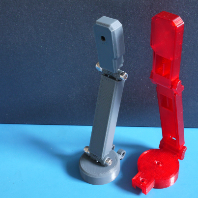

# Miniature Camera Enclosure (M2.5 edition)

Fits this product sold by [Adafruit](https://www.adafruit.com/products/1937)

Extrusion width: 0.48mm

## Printing notes

This case was designed around a 0.48mm extrusion width. This gives the features on the case a bit of added strength. If the case isn't printing quite right, try adjusting the slicer's extrusion width.

## Enclosure Hardware (Bill of Materials)

2x M2.5x16mm 
2x M2.5 Hex Nuts
2x M2.5 Nylock Nut

The ones used for testing were sourced from Trimcraft Aviation RC -- these should also be available on Amazon and McMaster-Carr. 

Fasteners are ideal to tie everything together, but in a pinch, junk works too (i've tried all of these except for filament hot tapping:

* Zip ties (tightening the tie to set position is pretty interesting).
* Glue (cyanoacrylates/super glue/hot glue).
* Straightened 1.75mm filament (roll it on a heated bed) hot tapped with a soldering iron to fix it onto the ends.
* Tying somewhat flexible filament together (gets tricky, but it works).

## Assembly

* Print everything individually, including the case covers.

* Weave the camera cable into the case.

* Cover everything, adjust positioning with the screws/other hardware.

* Connect to a Pi.
